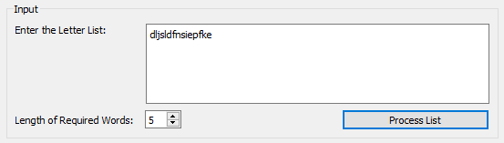
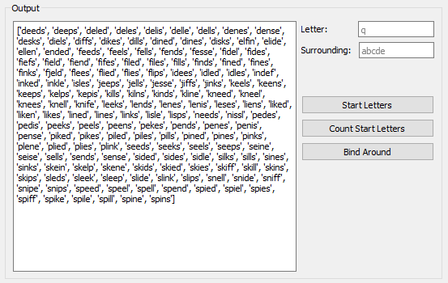
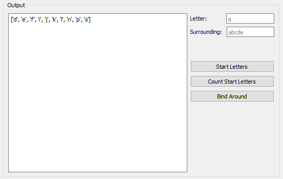
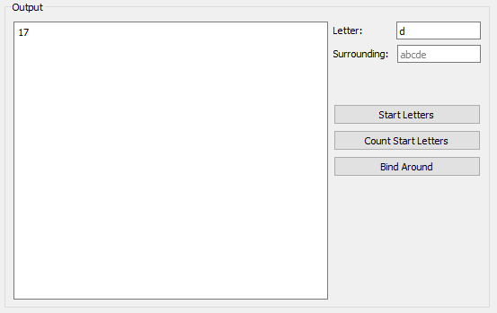
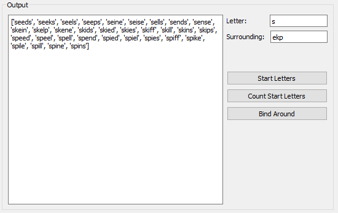

# Word Puzzle Brute Forcer

A freeware and educational program that helps in reducing and almost solving word games puzzles. It has an input section to enter the list of letters given and the length of words required.

	Then you get an output list of words which you can also manipulate with 3 options.

######Option 1 - Start Letters
	This option gives you a list of unique letters that begins the list of words in 
	the word list result.

######Option 2 - Count Start Letters
	This option gives you a count of the words in the word list result that begins with
	the letter inputed in the "Letter" textbox.

######Option 2 - Bind Around
	This option gives you a list of the words in the word list result that begins with 
	the letter inputed in the "Letter" textbox and has its second letter as any of the
	letters inputed in the "Surrounding" textbox.

   

License
----------
    MIT license.
        
        